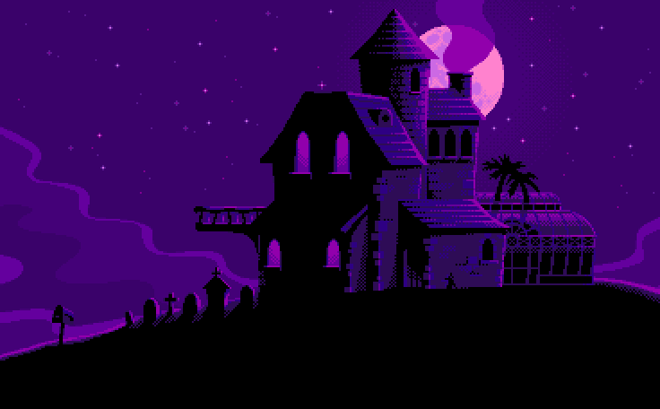

This is my portfólio with 8 bit theme and I created it to showcase my projects, skills, about me and how to contact me. I hope you enjoy the experience of meet it. Enjoy yourself!

## Technologies
 

## Licença
